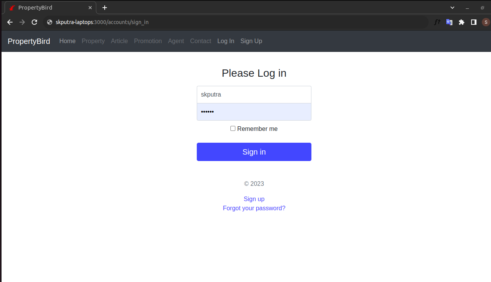

# RubyOnRails-Portfolio
Properties-Admin Application

# Technology
- Ruby 3.2.0
- Rails 7.0.7.2
- Javascript
- Bootstrap
- rspec-rails
- factory_bot_rails
- image_processing
- devise
- sassc-rails
- faker
- ransack
- will_paginate-bootstrap4
- service
- sqlite3 / mysql /postgree  
  
# Installation
bundle install
 
rails db:migrate
 
# Run Server
rails s
 
# Run Test RSpec
bundle exec rspec
  
  
# Screenshoot
  
Homepage Screenshoot :

  
Login Screenshoot :

  
Dashboard Screenshoot :

  
Properties Screenshoot :

  
Pin Details Screenshoot

  
Vendor Screenshoot

  
Promo Galleries Screenshoot

  
Registration Screenshoot

 
